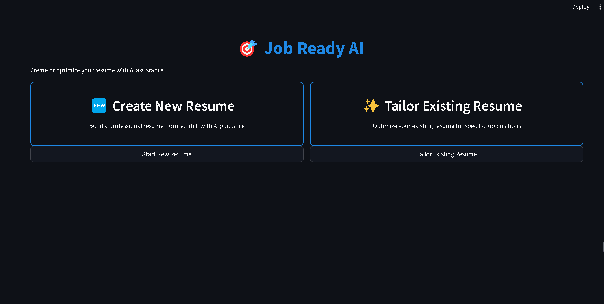
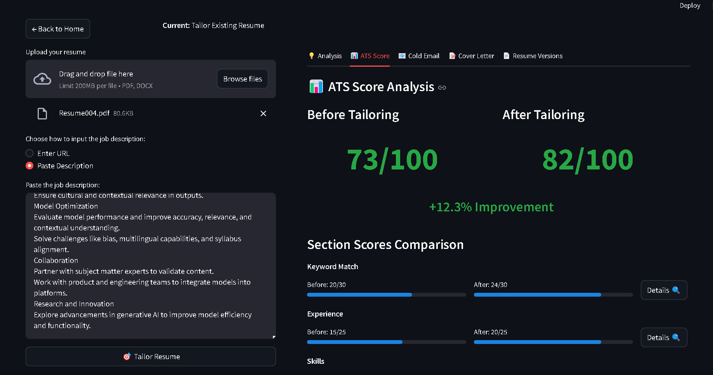

# Job Ready AI



## 📌 Problem Statement

Job seekers struggle with **creating professional, ATS-friendly resumes** that align with job descriptions. Key challenges include:

❌ **Personalization Issues** – Crafting unique resumes, cold emails, and cover letters is time-consuming.  
❌ **Time-Consuming Process** – Manually adjusting resumes and cover letters is tedious.  
❌ **Lack of Expertise** – Many fail to highlight relevant skills effectively.  
❌ **Inconsistent Formatting** – Maintaining a professional look across applications is difficult.  
❌ **ATS Compatibility Issues** – Poorly formatted resumes get rejected by ATS systems.  
❌ **No ATS Score Evaluation** – Candidates lack tools to assess ATS compatibility.  

## ✅ Solution – AI-Powered Resume Tailoring Tool

An **AI-driven platform** that streamlines **resume creation, optimization, and personalization** to help job seekers succeed.

## 🎯 Key Features

### 🖥️ **User-Friendly Interface**
- Built with **Streamlit** for intuitive navigation.

### 📄 **AI-Powered Resume Creation**
- Just enter your details and get a **professionally formatted** resume instantly.

### 🔍 **Resume Parsing**
- Extracts content from **PDF/DOCX** using `pdfminer` and `python-docx`.

### 🌐 **Job Description Scraping**
- Uses **LangChain & BeautifulSoup** to extract job descriptions from online listings.

### 🧠 **Skill Matching**
- Uses `sentence_transformers` to analyze **matched & missing skills** in the job description.

### 📊 **ATS Score Calculation**
- Evaluates your resume’s **ATS compatibility** and suggests improvements.

### ✨ **Resume Tailoring with AI**
- Uses **Llama models & ChatGroq API** to **rewrite** resume sections **highlighting relevant skills**.

### 📩 **Cold Email & Cover Letter Generation**
- AI-generated **personalized emails and cover letters** for applications.

### ✅ **ATS Compatibility Assurance**
- Ensures **correct formatting** and **ATS keyword optimization** for better screening.

### 📊 **Complete Resume Analysis**
- Provides a detailed report including **strengths, weaknesses, missing keywords, and optimization tips**.

### 📥 **Download Options**
- Save **tailored resumes, emails, and cover letters** in **PDF & HTML** formats.

---


## 🛠️ Tech Stack

### **Frontend**
✅ **Streamlit** – UI framework for interactive web applications.

### **Backend**
✅ **Python** – Core programming language.  
✅ **pdfminer, python-docx** – Extracts resume text.  
✅ **BeautifulSoup, WebBaseLoader** – Scrapes job descriptions.  
✅ **requests, json** – Handles API calls and data processing.

### **Generative AI**
✅ **LangChain** – Scrapes & processes job descriptions.  
✅ **sentence_transformers** – Matches job descriptions to resumes.  
✅ **Llama models & ChatGroq API** – Tailors resumes & extracts job information.

### **Environment & Document Management**
✅ **dotenv** – Securely manages API keys.  
✅ **PyPDF2, jinja2** – Generates PDF/HTML resumes and emails.

---

## 🚀 Installation Guide

### 📌 Prerequisites
✅ **Python 3.7+**  

✅ **Groq API Key** – Get it from [Groq Console](https://console.groq.com)

---

### 📌 Installation Steps

1️⃣ **Clone the repository**
```bash
git clone <repository-url>
cd resume-tailor
```

2️⃣ **Create a virtual environment**
```bash
python -m venv venv
source venv/bin/activate  # Linux/Mac
venv\Scripts\activate     # Windows (Command Prompt)
venv\Scripts\activate.bat # Windows (PowerShell)
```

3️⃣ **Install dependencies**
```bash
pip install -r requirements.txt
```

4️⃣ **Set up environment variables**
```bash
echo "GROQ_API_KEY=your_api_key_here" > .env
```

5️⃣ **Run the Streamlit app**
```bash
streamlit run main.py
```

6️⃣ **Access the application**
- Go to `http://localhost:8501`

---

## 🔥 Use Cases

📝 **Resume Tailoring & Optimization** – Enhances ATS scores for better shortlisting.  
📩 **Cold Email & Cover Letter Generation** – Saves time with AI-crafted personalized communication.  
⏳ **Time Efficiency** – Automates repetitive tasks, allowing users to focus on interviews.  
📊 **ATS Score Calculation** – Helps users **quantify** their resume’s effectiveness.

---

## 🔮 Future Scope

🚀 **Automated Job Applications** – Scrape job platforms like **LinkedIn, Indeed, Naukri.com** and auto-apply.  
🎙️ **Interview Preparation Assistance**  
- **AI-Curated Interview Questions** – Role-specific questions tailored by AI.  
- **AI Mock Interviews** – Real-time feedback on responses.  
📈 **Enhanced ATS Optimization** – AI adapts to evolving ATS algorithms.

---

## 🤝 Contributing

Want to contribute? Follow these steps:
1. **Fork the repository**
2. **Create a feature branch**
3. **Commit your changes**
4. **Push to the branch**
5. **Create a Pull Request**

---

## 📜 License

This project is licensed under the **MIT License** – see the LICENSE file for details.

---

## 🙌 Acknowledgments

💡 **Groq** – For LLM API.  
💡 **Streamlit** – For the web framework.  
💡 **wkhtmltopdf** – For PDF generation.  
💡 **All open-source contributors** – Thank you for your support!

---

## 📧 Contact

For support or queries, open an **issue** in the repository.  

🚀 **Made with ❤️ using AI & Python**

